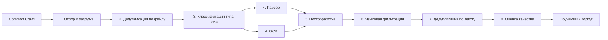
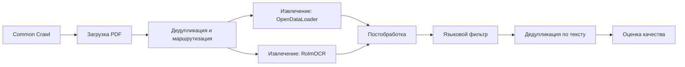

# Статистический анализ цифровых документов архивов CommonCrawl

Тема дипломного проекта: статистический анализ PDF из архива Common Crawl на базе конвейера FinePDFs. В проекте вместо Docling для «обычных» PDF используется OpenDataLoader PDF, позже планируется сравнить скорость извлечения текста.

Вид работы: дипломный проект (записка + графика + программа).

Статус документа: глава 1 — теоретическая часть, глава 2 — практическая (описание реализованного приложения по [методическим рекомендациям БГУ, 2024](Metod-rekom-po-org-diplomnogo-proektir-BGU-2024.pdf)). Цифры экспериментов (отсев по этапам, сравнение Docling и OpenDataLoader) — после полного прогона (п. 2.6.3–2.6.4, заключение).

Как читать документ: там, где написано «подтверждение автором», в записку переносите только то, что сами проверили.

---

## Реферат (черновик)

Ключевые слова: АРХИВ COMMON CRAWL, PDF, FINEPDFS, OPENDATALOADER PDF, ДЕДУПЛИКАЦИЯ, РАСПОЗНАВАНИЕ СКАНОВ, СТАТИСТИКА КОРПУСА

В работе используется открытый конвейер обработки FinePDFs: из PDF в Common Crawl получают текст для обучения языковых моделей. Главное изменение: для PDF с уже встроенным текстом вместо Docling (как в оригинале FinePDFs) подключён OpenDataLoader PDF. Описано, как считать статистику на каждом шаге и как сравнить скорость Docling и OpenDataLoader. Конкретные цифры (сколько документов отсеялось, во сколько раз быстрее) будут в главе 2 и в заключении после экспериментов.

---

## ВВЕДЕНИЕ

Большие языковые модели (ChatGPT, Llama и др.) сейчас быстро развиваются и для обучения им нужны огромные массивы текста. Некоторая часть этого текста — не HTML-страницы сайта, а файлы PDF: статьи, отчёты, инструкции, сканы. Чтобы превратить эти PDF в пригодный для обучения текст, на практике используют многошаговый конвейер: найти документы, скачать, убрать дубликаты, извлечь текст, почистить и отфильтровать.

Архив Common Crawl — это большой снимок интернета. PDF оттуда нельзя сразу отдавать модели: много мусора, повторов, сканов без текста, смешения языков. Нужна длинная цепочка шагов: найти PDF, скачать, убрать дубликаты, вытащить текст, почистить, отфильтровать по языку и качеству

Открытый проект FinePDFs описывает именно такой рабочий конвейер и служит основой для наборов данных, на которых учат современные LLM. Поэтому разбор этого конвейера, статистика отсева на каждом шаге и его доработка актуальны: они показывают, как на самом деле готовят PDF-текст для моделей, которые активно внедряются в науку, образование и повседневную жизнь.

Цель — доработать конвейер FinePDFs для анализа PDF из Common Crawl (замена Docling на OpenDataLoader) и измерить, насколько быстрее стало извлекать текст, при этом данные должны проходить дальнейшие шаги обработки.

Объект исследования — PDF из Common Crawl и программа, которая превращает их в текстовый набор данных.

Предмет исследования — метрики конвейера (сколько файлов на входе и выходе, языки, длина текста и др.) и сравнение скорости Docling и OpenDataLoader.

Задачи:

1. Разобраться, как устроены Common Crawl и конвейер FinePDFs;
2. сравнить Docling и OpenDataLoader как способы вытащить текст из «цифрового» PDF;
3. встроить OpenDataLoader в программу и согласовать постобработку;
4. описать, какие метрики считать на каждом шаге;
5. прогнать конвейер с Docling и OpenDataLoader;
6. замерить метрики Docling и OpenDataLoader;
7. сделать статистику по метрикам.

---

## 1 АНАЛИЗ ПРЕДМЕТНОЙ ОБЛАСТИ И ТЕОРЕТИЧЕСКИЕ ОСНОВЫ

### 1.1 Большие языковые модели и роль текстовых корпусов

Большие языковые модели (LLM, Large Language Models) — это нейросетевые системы, обученные предсказывать следующий фрагмент текста на очень больших массивах данных. Примеры таких моделей: семейства GPT, Llama, Mistral и др. Качество ответов модели во многом зависит не только от архитектуры сети, но и от того, на каких текстах её обучали: объёма корпуса, разнообразия тем, языков и стилей.

Для обучения и дообучения моделей используют специально подготовленные наборы данных (корпуса). Источники удобно различать по формату, в котором текст хранится и извлекается, а не только по типу содержания (статья, книга, форум):

- веб-страницы — чаще всего HTML (или близкая разметка), из которой программно получают видимый текст, в таком виде в корпус попадают новости, посты на форумах, справочные материалы, фрагменты статей и книг, если их выложили как обычную страницу сайта;
- файлы PDF — отдельный формат, в нём те же по смыслу материалы (научные и популярные статьи, главы и целые книги, отчёты, инструкции, сканы бумажных документов) могут распространяться или сохраняться именно как PDF, в том числе после скачивания с сайта и попадания в веб-архив;
- готовые текстовые наборы (файлы, репозитории без привязки к HTML или PDF конкретной страницы).

Один и тот же текст теоретически может существовать и как страница сайта, и как PDF-файл. Для обучения LLM это разные ветки подготовки данных. Подготовка PDF-корпусов из веб-архивов (в том числе Common Crawl) — отдельное направление по сравнению с обработкой HTML.

PDF требует отдельной технологической цепочки не потому, что только в PDF бывают статьи или книги, а потому что извлечение текста из PDF устроено иначе, чем с HTML: файл нужно получить как бинарный объект, при необходимости распознать со скана, извлечь или восстановить текст, очистить и проверить язык. Для крупных корпусов применяют специализированные решения (в том числе открытый проект FinePDFs), а не тот же парсер, что для веб-страниц.

Развитие LLM идёт быстро: модели становятся крупнее, расширяются требования к данным. Изучение того, как из сырого архива интернета получают пригодный для обучения PDF-текст, остаётся актуальной задачей и для промышленных команд, и для исследований.

### 1.2 Формат PDF и виды документов в корпусе

PDF (Portable Document Format) — распространённый формат электронных документов, закреплённый как открытый стандарт ISO. Внутри файла может храниться:

- текстовая информация (символы, шрифты, координаты на странице) — тогда текст можно извлечь программно;
- только изображения страниц (отсканированный документ) — тогда нужно распознавание текста со скана (OCR);
- смешанный вариант: часть страниц с текстом, часть как картинки.

При подготовке корпусов PDF обычно различают две технические группы:

1. PDF с встроенным текстом — текст уже есть в структуре файла, его получают парсерами и извлекателями (Docling, OpenDataLoader PDF и др.);
2. отсканированный PDF — страницы хранятся как изображения, встроенного текста нет, чтобы его получить применяют OCR, в том числе нейросетевые модели (RolmOCR и аналоги).

От качества классификации документа и выбора метода извлечения зависит, сколько полезного материала попадёт в итоговый корпус.

### 1.3 Архив Common Crawl

Common Crawl — некоммерческий открытый проект, который периодически сохраняет копии страниц интернета и публикует их для исследований. Каждый такой снимок называют краулом и обозначают идентификатором, например CC-MAIN-2019-43.

Основные элементы архива, важные для работы с PDF:

1. Индекс Common Crawl — таблица записей: URL, тип содержимого, ссылка на место в архиве, по индексу отбирают кандидатов в PDF, не просматривая весь архив целиком;
2. архивы ответов сайтов в формате WARC (Web ARChive) — контейнеры, в которых хранятся HTTP-ответы, в том числе тела файлов PDF, чтение идёт по смещению (offset) внутри WARC-файла, указанному в индексе;
3. локальные сжатые копии — при массовой загрузке PDF их часто сохраняют отдельно в сжатом виде (например, алгоритм Zstandard, расширение .zstd), чтобы не обращаться к WARC при каждом повторном чтении.

При сохранении краула отдельные HTTP-ответы иногда обрезают (truncated): тело файла в WARC неполное. В таких случаях надёжнее опираться на полную локальную копию PDF, если она была успешно скачана отдельно.

Common Crawl — один из крупнейших открытых источников веб-данных. На его основе строят корпуса для обучения языковых моделей, в том числе с выделением PDF-документов.

### 1.4 Проект FinePDFs и подготовка PDF-корпусов

FinePDFs — открытый проект (Hugging Face, 2025), направленный на подготовку PDF из Common Crawl в текстовый корпус для обучения языковых моделей. Общая идея многоэтапной фильтрации и очистки веб-текста, но целевой объект — файлы PDF, а не HTML-страницы.

FinePDFs описывает полный цикл: от поиска PDF в индексе краула до публикации отфильтрованного набора данных. Итоговый корпус — не все PDF из архива, а подмножество после удаления дубликатов, отбора по языку и оценки качества текста. На основе проекта формируют открытые датасеты, используемые при обучении современных LLM.

### 1.5 Общая схема подготовки PDF-корпуса из веб-архива

Независимо от конкретной программной реализации, подготовка PDF из Common Crawl для обучения LLM обычно строится как многоэтапный конвейер. Общая схема такого конвейера приведена на рисунке 1. Логические этапы:

1. отбор и загрузка — поиск PDF в индексе краула, скачивание из WARC или по URL для получения исходных файлов;
2. дедупликация по файлу — удаление побайтовых копий;
3. классификация типа PDF — «цифровой» (есть встроенный текст) или «скан», выбор метода извлечения;
4. извлечение текста — парсер или OCR, переход от PDF к строке текста;
5. постобработка — нормализация, удаление колонтитулов, повышение читаемости текста;
6. языковая фильтрация — определение языка и отбор нужных, формирование целевого многоязычного или моноязычного корпуса;
7. дедупликация по тексту — точные и приближённые повторы, снижение избыточности для обучения;
8. оценка качества — классификаторы полезности текста, отсев мусора и низкокачественных страниц.

*Рисунок 1 — Общая схема конвейера*

На каждом этапе часть документов отсеивается (не скачались, дубликат, не тот язык, пустой текст после извлечения и т.д.). Количественный учёт отсева на каждом шаге составляет предмет статистического анализа в данной работе: он показывает, какой доле исходного массива PDF удаётся превратить в пригодный для модели текст и где теряется больше всего материала.

Конвейеры такого масштаба реализуют как потоковую обработку: документы проходят цепочку независимых преобразований, промежуточные результаты сохраняют для возобновления работы и для подсчёта статистики без повторного извлечения текста. В проекте FinePDFs для этого используют экосистему Hugging Face.

### 1.6 Извлечение текста из PDF с встроенным текстом

Для PDF с текстовой информацией текст извлекают без распознавания изображений страницы — из уже закодированных в файле символов и метаданных разметки. В исследованиях и промышленных конвейерах чаще всего сравнивают два класса решений: тяжёлые структурные парсеры на основе машинного обучения и более лёгкие извлекатели на классических PDF-библиотеках.

#### 1.6.1 Docling

Docling — открытое решение IBM для структурного разбора PDF. Система анализирует расположение блоков, таблицы, порядок чтения страниц и формирует связный текст. Применяются модели компьютерного зрения и разметки документа.

Сильные стороны: высокое качество на сложных макетах (несколько колонок, таблицы, сноски, нелинейный порядок чтения). Слабые стороны: высокая вычислительная нагрузка, длительное время на документ, повышенные требования к оперативной памяти и при необходимости к GPU. В оригинальном конвейере FinePDFs Docling задан как основной извлекатель для PDF с встроенным текстом.

#### 1.6.2 OpenDataLoader PDF

OpenDataLoader PDF — инструмент извлечения текста с опорой на среду Java (JDK 11 и выше). На выходе получают текст, часто с разметкой, отражающей структуру страниц (например, Markdown).

Ориентация — скорость и умеренные ресурсы на «цифровых» PDF по сравнению с тяжёлыми нейросетевыми парсерами. На сложных макетах полнота и порядок текста могут уступать Docling. Выбор между инструментами — компромисс между качеством, скоростью и стоимостью вычислений. Docling опирается на нейросетевой разбор макета и в FinePDFs служит эталоном. OpenDataLoader использует классическое извлечение через JVM и предлагается как более быстрая замена.

Оба класса средств решают одну задачу: получить машиночитаемый текст там, где символы уже есть в файле.

### 1.7 Распознавание отсканированных PDF (OCR)

#### 1.7.1 Сущность OCR

OCR (Optical Character Recognition) — оптическое распознавание символов: восстановление текста по изображению страницы. Исторически использовали движки вроде Tesseract. В современных корпусах всё чаще применяют нейросетевые модели, в том числе на базе архитектур «изображение - текст» (vision-language), обученные на парах «скан страницы - эталонный текст».

OCR нужен, когда в PDF нет пригодного встроенного текста (чистый скан) или когда встроенный текст нечитаем (битая кодировка, «мусорные» символы).

#### 1.7.2 Маршрутизация: парсер или OCR

Обрабатывать весь архив только OCR экономически невыгодно: распознавание на порядки медленнее и требует GPU. Поэтому в конвейерах вводят предварительную классификацию документа:

- признаки файла (доля текста и изображений, число шрифтов, метаданные сканера);
- эвристики и обученные модели (например, градиентный бустинг по признакам страниц);
- оценка «битости» извлечённого текста.

Документы с высокой вероятностью скана направляют в OCR-ветку, остальные — в ветку извлечения встроенного текста. Ошибка классификации ведёт к потере качества: скан, отправленный в парсер, даст пустой текст, а цифровой PDF, отправленный в OCR, дает лишние затраты.

В линейке FinePDFs для OCR-ветки предусмотрены нейросетевые модели уровня RolmOCR, для маршрутизации используется обученный классификатор по признакам PDF. Это отраслевой подход к масштабной обработке смешанных корпусов из веб-архива. Для PDF с встроенным текстом в параллельной ветке применяют парсеры, и именно на этом шаге в проекте Docling заменён на OpenDataLoader, тогда как OCR-ветка остаётся эталонной реализацией FinePDFs.

### 1.8 Фильтрация и очистка корпуса после извлечения текста

Извлечённый текст ещё не является готовым обучающим корпусом. К нему применяют дополнительные этапы:

1. дедупликация — удаление повторов на разных уровнях:
  - по байтам исходного PDF (полные копии файла);
  - по нормализованному тексту (точные дубликаты содержания);
  - приближённо («почти» копии).
   Избыточность ухудшает обучение: модель многократно видит одно и то же, искажая оценку новизны данных;
2. определение языка — для многоязычных корпусов используют классификаторы языка и письменности (в FinePDFs — GlotLID, метки вида eng_Latn, rus_Cyrl), отбирают документы целевых языков по порогу уверенности, остальное отбрасывают или выделяют в отдельные подкорпуса;
3. оценка качества текста — модели оценивают, насколько фрагмент похож на осмысленный обучающий материал (научный, образовательный, связный прозаический текст), а не на рекламу, обрывки и таблицы без контекста, в FinePDFs для этого используют классификаторы направления edu и dclm;
4. постобработка — нормализация пробелов и кодировки, удаление повторяющихся колонтитулов и номеров страниц, что влияет на итоговый объём корпуса в токенах и на его чистоту.

### 1.9 Статистический анализ корпуса: показатели и методика

#### 1.9.1 Токены как мера объёма

Токен — единица, в которую токенизатор конкретной LLM разбивает текст. У разных моделей (GPT, Llama и др.) токенизаторы различаются, поэтому абсолютное число токенов зависит от выбранного эталона. Для сопоставления корпусов и этапов конвейера используют один фиксированный счётчик токенов (в FinePDFs — привязка к семейству Llama) — не как единственно верную меру для всех моделей, а как сопоставимую меру объёма.

#### 1.9.2 Основные статистические показатели

- объём выборки: число записей в индексе, число скачанных PDF;
- отсев по этапам: документов на входе и выходе, доля отброшенных в процентах;
- ветвление: доля OCR и текстовых PDF;
- извлечение: доля успешных и неуспешных извлечений, пустой текст;
- язык: распределение по меткам GlotLID;
- объём текста: сумма и среднее число токенов на документ;
- сравнение извлекателей: время на документ, ускорение Docling и OpenDataLoader.

### Выводы

Для обучения LLM необходимы масштабные текстовые корпуса, и среди источников таких данных PDF из веб-архивов выделяются как отдельный класс: в отличие от HTML-страниц они требуют отдельной цепочки подготовки. Масштабный открытый поток таких файлов даёт Common Crawl через индекс и WARC, а конвейер FinePDFs описывает, как из него получить обучающий корпус — отбором документов, извлечением текста, дедупликацией, языковой и качественной фильтрацией и нормализацией, при этом для «цифровых» PDF и сканов используют парсеры и OCR соответственно. В эталонном FinePDFs для PDF с встроенным текстом применяют Docling: он хорошо разбирает сложный макет, но требует много времени и ресурсов. Главная задача проекта — заменить Docling на более быстрый OpenDataLoader PDF и встроить его в тот же конвейер, чтобы последующие шаги обработки продолжали работать без изменений. Статистический анализ отсева по этапам и сравнение времени извлечения служат для проверки, что такая замена сохраняет работоспособность конвейера и даёт ожидаемое ускорение.

---

## 2 РАЗРАБОТКА ПРОГРАММНОГО ОБЕСПЕЧЕНИЯ И ЭКСПЕРИМЕНТАЛЬНЫЕ ИССЛЕДОВАНИЯ

Вторая глава — практическая часть дипломного проекта. В ней подробно описано реализованное приложение на базе открытого конвейера FinePDFs: как устроена обработка PDF из архива Common Crawl, какие технологии задействованы, что изменено в рамках диплома (замена Docling на OpenDataLoader PDF), какие параметры задают масштаб прогона, какие метрики собирают для статистики и как сравнивают два извлекателя текста.

Схема логических этапов приведена в главе 1 (рисунок 1). Схема реализации дипломной конфигурации — на рисунке 2.

*Рисунок 2 — Реализация конвейера в дипломном проекте*

---

### 2.1 Архитектура и компоненты конвейера обработки данных

Практическая часть диплома опирается на готовый открытый конвейер FinePDFs и его доработку под учебный стенд. Прежде чем говорить об экспериментах, нужно понять каркас системы: из каких логических частей она состоит, как данные переходят от этапа к этапу и где в этой цепочке сделана замена извлекателя текста.

#### 2.1.1 Анализ общей структуры конвейера FinePDFs

FinePDFs реализует сквозной процесс подготовки PDF из веб-архива к обучающему корпусу. В дипломном проекте он разбит на восемь последовательных этапов, согласованных с теоретической схемой (рисунок 1).

На первом этапе в поток попадают только PDF из Common Crawl: программа обходит индекс краула или список WARC-файлов, отбирает HTTP-ответы с PDF, при необходимости догружает файл по URL и сохраняет промежуточный результат. Уже здесь часть документов отсеивается (не PDF, ошибка загрузки, пустой ответ).

На втором этапе выполняют побайтовую дедупликацию и маршрутизацию. Одинаковые файлы удаляют, оставшиеся делят на две ветки: документы, где текст можно извлечь парсером встроенного текста, и документы, которые с высокой вероятностью являются сканами и требуют OCR.

На третьем этапе извлекают текст. В оригинале FinePDFs для «цифровых» PDF используют Docling. В дипломной реализации на этом месте стоит OpenDataLoader PDF. Для ветки сканов предусмотрен RolmOCR — нейросетевое распознавание страниц.

Четвёртый этап — постобработка: нормализация строк, удаление колонтитулов, первичная разметка языка, подсчёт токенов. Пятый — языковой фильтр и раскладка по языковым подкорпусам. Шестой и седьмой — дедупликация уже по тексту (точная и приближённая). Восьмой — оценка качества текста классификаторами направления edu и dclm.

Модульность обеспечивается библиотекой потоковой обработки datatrove. Каждый этап — набор независимых блоков (чтение, фильтр, преобразование, запись). Между этапами документы сериализуют в сжатые JSONL-файлы: можно остановить прогон, посчитать статистику и продолжить без повторной загрузки всего архива. Масштабируемость в промышленном варианте достигается распараллеливанием воркеров и выносом тяжёлых моделей на GPU-кластер. На учебном компьютере тот же каркас работает в упрощённом режиме (один процесс, без OCR-извлечения).

Оркестратор запускает этапы строго по порядку. Если на входе этапа нет документов, этап пропускается с записью в журнал. Если после критических этапов (загрузка, маршрутизация, извлечение) поток пуст, программа завершается с пояснением: не найдены PDF, не установлена Java, не подтянуты веса классификатора сканов и т.д.

Единица данных — документ с полем текста, словарём метаданных (URL, язык, вероятность OCR, число страниц) и вложением с байтами PDF. Такой формат един для всех этапов и позволяет менять один блок (извлекатель) без перестройки всего конвейера.

#### 2.1.2 Определение ключевых технологий и их роли

PyMuPDF используют на этапе маршрутизации. Библиотека быстро открывает PDF, читает встроенный текст со страниц, считает шрифты, текстовые блоки, изображения, долю площади под картинками, признаки сканера в метаданных. Эти признаки подают в классификатор XGBoost. PyMuPDF выбран как лёгкая и распространённая основа для извлечения признаков без полного разбора макета.

Docling в оригинале FinePDFs — основной извлекатель для PDF с встроенным текстом. Он анализирует структуру страницы нейросетевыми моделями разметки: порядок чтения, таблицы, колонки. Даёт высокое качество на сложных макетах, но требует много времени, оперативной памяти и опирается на тяжёлые модели (в том числе квантованные через OpenVINO для ускорения на CPU). В дипломе Docling сохранён как эталон для сравнения, но в рабочем прогоне заменён на OpenDataLoader.

OpenDataLoader PDF — дипломная замена Docling. Извлечение идёт через Java-машину (нужен JDK 11+), без нейросетевого layout analysis на стороне Python. Текст получают в виде Markdown с разметкой страниц. Это компромисс: ниже качество на самых сложных вёрстках, но существенно выше скорость и проще требования к железу на учебном ПК.

XGBoost на этапе маршрутизации решает задачу бинарной классификации «парсер или OCR». Градиентный бустинг хорошо работает на табличных признаках с PDF, обучен на размеченной выборке в рамках проекта FinePDFs. Альтернатива — гонять все файлы через OCR, что в сотни раз дороже.

RolmOCR и сервер vLLM обслуживают ветку сканов: модель vision-language получает изображение страницы и генерирует текст. Без NVIDIA GPU и Linux этот этап в дипломной установке отключают, но маршрутизация всё равно показывает, какая доля корпуса ушла бы в OCR.

GlotLID используют для определения языка и письменности (метки вида eng_Latn, rus_Cyrl). Это компактный классификатор языка, встроенный в datatrove, а не генеративная LLM. Он применяется на постобработке и на отдельном языковом этапе. В оригинальном FinePDFs для отдельных GPU-этапов (например, отсев пустых страниц OCR) могут подключаться большие модели вроде Qwen2.5-VL через тот же vLLM — это уже не языковая идентификация, а анализ содержимого страницы.

Библиотека datatrove связывает этапы в единый поток. Счётчик токенов привязан к токенизатору семейства Llama — для сопоставимой оценки объёма корпуса между этапами, как в публикации FinePDFs.

Итог по технологиям: тяжёлые нейросети сосредоточены на OCR и качестве сканов, а дипломный вклад переносит «цифровую» ветку на более лёгкий стек (OpenDataLoader + Java), сохраняя общий каркас FinePDFs.

---

### 2.2 Подготовка данных и предварительная фильтрация

Прежде чем извлекать текст, поток PDF из интернета нужно сузить, очистить от технических дубликатов и разделить по способу извлечения.

#### 2.2.1 Источники данных и критерии фильтрации

Основной источник — архив Common Crawl. Каждый снимок краула имеет идентификатор (например, CC-MAIN-2019-43). Программа получает список WARC-файлов, в которых лежат HTTP-ответы сайтов, и извлекает из них PDF.

Критерии отбора на этапе загрузки следуют логике авторов FinePDFs:

- отбирают только ответы с типом содержимого PDF;
- различают полные и усечённые записи WARC (когда тело файла в архиве обрезано) — усечённые догружают по исходному URL;
- проверяют MIME-тип после загрузки;
- отделяют успешные загрузки от ошибок сети и таймаутов;
- сохраняют байты PDF локально в сжатом виде для повторного использования на следующих этапах.

Объём просмотра архива на первом этапе задаёт параметр LIMIT. В дипломной конфигурации по умолчанию LIMIT равен 5000. Это означает не «5000 PDF», а «просмотреть до 5000 записей WARC» (HTTP-ответов в индексе). Среди них PDF может оказаться существенно меньше. Параметр меняют в настройках оркестратора перед запуском, если после первого этапа документов слишком мало — увеличивают LIMIT или выбирают другой краул.

Идентификатор краула задают при запуске (параметр командной строки crawl-ids). Можно указать несколько краулов через запятую — обработка идёт последовательно.

На втором этапе фильтрация продолжается: удаляют побайтовые дубликаты PDF. Два разных URL с одинаковым файлом оставляют в корпусе один раз. Затем каждый оставшийся документ классифицируют для маршрутизации. Критерии маршрута: вероятность скана не ниже 0,2 или наличие «битого» встроенного текста (символы замены Unicode) — тогда документ идёт в OCR. Иначе — в ветку парсера (в дипломе — OpenDataLoader).

Дополнительные критерии качества и объёма появляются позже: пустой текст после извлечения, отсутствие смещений страниц, язык вне списка целевых, низкий балл классификаторов edu/dclm, точные и приближённые повторы текста.

#### 2.2.2 Языковая классификация и фильтрация

Язык документа определяют не генеративной LLM, а классификатором GlotLID в составе datatrove. На этапе постобработки каждому документу проставляют метку языка и письменности с порогом уверенности 0,01 (в режиме «только метка», без немедленного отсева). Это даёт возможность анализировать состав корпуса до жёсткой фильтрации.

Отдельный языковой этап раскладывает документы по языковым подкорпусам. Для отдельных языков могут применяться индивидуальные пороги уверенности из заранее подготовленного набора значений — так в оригинале тонко отсекали редкие или смешанные языки.

При запуске можно ограничить список языков (параметр languages, например eng_Latn и rus_Cyrl). Тогда этапы дедупликации по тексту и оценки качества выполняют только для выбранных подкорпусов. Если параметр не задан, обрабатывают все языки, которые прошли постобработку.

Данные GlotLID используют для статистики (распределение языков на каждом этапе) и для маршрутизации в смысле «какой подкорпус дальше чистить». Генеративные модели (RolmOCR, Qwen на GPU) в этом проекте относятся к извлечению и постобработке сканов, а не к определению языка.

---

### 2.3 Извлечение текста и анализ структуры

Этап извлечения — центральный для диплома: здесь PDF превращается в строку текста, пригодную для фильтров и подсчёта метрик.

#### 2.3.1 Извлечение встроенного текста: Docling и OpenDataLoader

В эталонном FinePDFs для PDF с встроенным текстом применяют Docling. Программа анализирует макет страницы: блоки текста, таблицы, порядок чтения, иногда изображения. На выходе — связная строка с сохранением структуры. Настройки ориентированы на максимальное качество «чистого» текста для обучения моделей. Интеграция в конвейер — как отдельный блок извлечения после маршрутизации: на вход байты PDF, на выход текст и метаданные (число страниц, смещения страниц в строке).

Docling опирается на модели Docling IBM и может использовать квантование OpenVINO для ускорения inference на CPU. Даже с оптимизацией один документ обрабатывается долго, а на больших корпусах из Common Crawl это становится узким местом всего пайплайна.

В дипломном проекте на том же месте конвейера установлен OpenDataLoader PDF. Принцип другой: PDF передаётся в Java-библиотеку, которая извлекает текст и формирует Markdown. Страницы разделяют специальной меткой, чтобы посчитать число страниц и смещения для постобработки. Нейросетевой разбор макета на стороне Python не выполняется.

Перед конвертацией проверяют наличие Java 11 или новее. На Windows частая проблема — в системе по умолчанию остаётся Java 8, тогда извлечение пропускается целиком. Требуется явно указать современный JDK в переменных окружения.

Таймаут на обработку одного PDF в дипломной конфигурации — 600 секунд (10 минут), чтобы зависший файл не блокировал весь прогон. Успешные документы попадают в поток извлечённых, неуспешные (пустой текст, ошибка JVM) — в поток отказов.

Постобработка настроена так, чтобы принимать выход OpenDataLoader так же, как выход Docling: та же единая строка текста, те же поля смещений страниц. Отдельные правила, завязанные только на внутренний формат Docling, отключают флагом «текст не из Docling».

#### 2.3.2 Маршрутизация OCR на основе XGBoost

Чтобы не запускать OCR для всех файлов подряд, FinePDFs использует обученный классификатор на градиентном бустинге.

С каждого PDF случайно выбирают до восьми страниц (число согласовано с обучением модели). PyMuPDF извлекает с каждой страницы признаки: объём текста, число шрифтов, текстовых блоков, доля площади под изображениями, признаки «мусорных» картинок, метаданные сканера. Дополнительно на уровне документа считают долю битых символов во встроенном тексте.

Модель выдаёт вероятность ocr_prob — что документ похож на скан. Если ocr_prob не ниже 0,2 или garbled_text_ratio больше нуля, файл направляют в ветку OCR. Иначе — в ветку парсера (OpenDataLoader в дипломе).

Решение принимается для файла целиком. Смешанные PDF (часть страниц текст, часть скан) не разбивают на два метода — это упрощает реализацию, но может давать ошибки маршрутизации, что видно в статистике отсева.

Веса классификатора поставляются вместе с проектом (через Git LFS). Без них второй этап не создаст ветку для парсера, и конвейер остановится с ошибкой.

#### 2.3.3 Оптимизация производительности

Узкое место оригинального FinePDFs на CPU — извлечение Docling. Авторы применяют квантование моделей разметки через OpenVINO, чтобы ускорить inference без полноразмерного GPU. Это снижает время, но не доводит обработку до скорости, комфортной для учебного эксперимента на одном компьютере.

Главная оптимизация диплома — замена Docling на OpenDataLoader для всей ветки «цифровых» PDF. OpenDataLoader не загружает тяжёлые PyTorch-модели layout analysis в память Python, а выполняет классическое извлечение через JVM. На типичных PDF прирост скорости измеряют отдельным сравнительным прогоном (п. 2.6.4).

Дополнительные меры в реализации:

- локальное кэширование списка WARC и сжатых PDF, чтобы не скачивать повторно;
- пропуск GPU-этапов при нулевом числе GPU (параметр gpus равен 0) — RolmOCR и тяжёлая постобработка сканов не запускаются;
- потоковая запись JSONL между этапами без удержания всего корпуса в оперативной памяти;
- таймаут на один PDF при извлечении.

На сервере с GPU узким местом становится RolmOCR и при необходимости Qwen2.5-VL на постобработке сканов. Для дипломной темы (статистика и ускорение «цифровой» ветки) достаточно CPU-конфигурации с Java 11+.

#### 2.3.4 Сравнение Docling и OpenDataLoader в дипломном проекте

Сравнение вынесено в отдельную процедуру, чтобы не замедлять основной прогон конвейера.

Берут одну и ту же выборку PDF после маршрутизации (ветка парсера, без OCR). Каждый файл по очереди обрабатывают дважды: сначала OpenDataLoader, затем Docling (или в обратном порядке, но на одном компьютере и без фоновой нагрузки). Для обоих методов действует одинаковый таймаут 600 секунд на документ.

Фиксируют:

- число PDF в выборке;
- сколько файлов каждый метод обработал успешно;
- длину извлечённого текста (для оценки, не «пустой» ли результат);
- суммарное время и среднее время на один PDF;
- ускорение как отношение времени Docling ко времени OpenDataLoader.

Ожидаемый вывод диплома: OpenDataLoader существенно быстрее на учебном стенде, при этом достаточная доля документов проходит дальше по конвейеру (постобработка, язык, дедупликация). Если на сложных макетах длина текста у OpenDataLoader заметно меньше, это оговаривают как компромисс скорости и полноты.

Численные результаты сравнения и формулировка «ускорение в K раз» вносятся в записку и графическую часть после личного замера. В приложении к записке приводят фрагменты реализации извлекателей и сценария сравнения.

---

### 2.4 Постобработка, очистка и дедупликация

Извлечённая строка ещё не является обучающим корпусом: её нормализуют, очищают от артефактов PDF и убирают повторы.

#### 2.4.1 Постобработка извлечённого текста

Постобработка дипломной ветки включает несколько последовательных преобразований.

Сначала в метаданные добавляют служебную информацию: источник извлечения OpenDataLoader, признак усечённого WARC. Удаляют избыточные поля, которые мог оставить эталонный прогон Docling.

Документы без текста или без массива смещений страниц отбрасывают — без смещений нельзя корректно резать текст по страницам и искать пустые страницы.

Нормализуют номера страниц в тексте, упрощают таблицы, убирают аннотации-картинки, если изображение занимает почти всю страницу. Удаляют повторяющиеся колонтитулы и служебные повторы (boilerplate). Применяют общую нормализацию пробелов, переносов и спецсимволов.

Затем срабатывает GlotLID (порог 0,01) и счётчик токенов Llama — это нужно и для фильтрации, и для метрик объёма корпуса.

Для ветки OCR при наличии GPU цепочка длиннее: агрессивнее чистят колонтитулы, склеивают неудачные страницы, могут применить Qwen2.5-VL для отделения страниц без текста от страниц с текстом. На CPU-установке диплома эта ветка постобработки не выполняется.

На позднем этапе качества применяют классификаторы edu и dclm — они оценивают, похож ли текст на образовательный или связный прозаический материал, а не на рекламу или обрывки. В полной конфигурации FinePDFs это требует GPU. Для статистики диплома важнее зафиксировать отсев на этапах 1–5 и сравнение извлекателей.

#### 2.4.2 Стратегии дедупликации данных

Дедупликация в конвейере двухуровневая.

Первая — по байтам PDF на раннем этапе. Совпадающие файлы удаляют до извлечения текста. Это дешёво и убирает точные копии документов, разошедшихся по разным URL.

Вторая — по тексту после извлечения и очистки, внутри каждого языкового подкорпуса. Точная дедупликация (exact) находит идентичные нормализованные строки. Приближённая (MinHash по n-граммам) находит кластеры почти одинаковых документов — зеркала, переформатированные версии, слабые перефразы. Из кластера оставляют один представитель.

Роль для итогового набора данных: снижение избыточности, чтобы языковая модель при обучении не видела один и тот же материал многократно. Для дипломной статистики по каждому виду дедупликации считают, сколько документов удалено и какой процент отсева это даёт относительно предыдущего этапа.

---

### 2.5 Инфраструктура и требования к окружению

#### 2.5.1 Анализ программных зависимостей

Зависимости проекта фиксируют в pyproject.toml и устанавливают через менеджер uv в виртуальное окружение Python 3.12.

Ключевые версии, важные для воспроизводимости:

- Python 3.12 и выше;
- PyTorch 2.6.0 (для Docling и GPU-опций);
- PyMuPDF 1.26.1 (признаки PDF и маршрутизация);
- XGBoost 3.x (классификатор сканов);
- OpenVINO 2025.3 (ускорение моделей Docling);
- opendataloader-pdf 2.4.4 и выше (дипломное извлечение);
- datatrove с веткой finepdfs (потоковый конвейер);
- Docling и связанные пакеты (эталон и сравнение).

Для учебной установки Windows GPU-зависимости (vLLM, flash-attn) не ставят — они вынесены в опциональную группу gpu и предназначены для Linux с NVIDIA.

Отдельно требуется JDK 11+ для OpenDataLoader. Скрипт установки проверяет Java после синхронизации Python-пакетов и предупреждает, если найдена только устаревшая Java 8.

На Windows дополнительно ставят пакет для определения MIME-типов файлов (libmagic), иначе фильтрация по типу PDF может работать некорректно.

#### 2.5.2 Аппаратные требования и масштабирование

Полный FinePDFs с OCR и постобработкой сканов рассчитан на сервер с NVIDIA GPU, Linux и большим объёмом RAM. vLLM обслуживает RolmOCR и при необходимости Qwen2.5-VL. Без GPU эти этапы пропускают.

Дипломная конфигурация на учебном ПК (Windows, CPU, 16+ ГБ RAM типично):

- этапы 1–2 и 4–5 для ветки OpenDataLoader выполнимы;
- этап 3 OCR не выполняется (gpus = 0);
- Docling для сравнения можно запустить на подвыборке, но полный корпус через Docling на одном ПК непрактичен.

Адаптация под CPU — не только отключение vLLM, но и замена Docling на OpenDataLoader в рабочем прогоне. Альтернативы вроде LMDeploy в оригинальной документации FinePDFs относятся к серверному inference LLM, в дипломной ветке они не разворачиваются: вместо этого OCR-ветка отключается, а основной результат даёт быстрый парсер.

Масштабирование на кластере в промышленном сценарии — увеличение числа воркеров datatrove, разнесение загрузки WARC и inference OCR по узлам, хранение промежуточных JSONL в объектном хранилище. Для диплома достаточно однопроцессного локального прогона с малым LIMIT.

---

### 2.6 Комплексный анализ и пути оптимизации конвейера

#### 2.6.1 Оценка эффективности пайплайна

Эффективность оценивают по времени, отсеву документов и качеству текста на выходе.

По времени главный выигрыш диплома ожидается на этапе извлечения «цифровых» PDF: OpenDataLoader против Docling. Остальные этапы в дипломной конфигурации сопоставимы с оригиналом. Загрузка из Common Crawl зависит от сети. Дедупликация и MinHash растут с размером корпуса, но на малой выборке (LIMIT 5000) остаются приемлемыми.

По отсеву строят «воронку»: сколько документов после каждого этапа. Типичные потери — не PDF и ошибки загрузки на этапе 1, дубликаты на этапе 2, отказ извлечения на этапе 3, пустой текст после постобработки, язык вне списка, повторы по тексту. Доля ушедших в ветку OCR показывает, какая часть корпуса потребовала бы GPU в полной установке.

По качеству на учебном стенде сравнивают длину извлечённого текста и долю успешных извлечений OpenDataLoader и Docling на одной выборке. Полная экспертная оценка читаемости не обязательна для диплома по статистике, но заметные расхождения длины на сложных PDF фиксируют в обсуждении ограничений.

#### 2.6.2 Выявление ограничений и потенциальных улучшений

Ограничения дипломной реализации:

- LIMIT задаёт верхнюю границу обхода WARC, а не число PDF — статистику нельзя напрямую сравнивать с промышленным корпусом без оговорки;
- без GPU не воспроизводится полный OCR-цикл и часть постобработки сканов;
- OpenDataLoader зависит от Java и может уступать Docling на сложной вёрстке;
- маршрутизация OCR по целому файлу ошибается на смешанных PDF;
- проект — учебный форк, а не официальный релиз датасета Hugging Face.

Потенциальные улучшения: увеличить LIMIT или сменить краул, развернуть GPU-ветку для полной статистики OCR, добавить этап ручной или автоматической проверки качества текста, тонкая настройка порога ocr_prob, гибридный режим OpenDataLoader с внешним сервисом для сложных страниц, перенос сравнения Docling/OpenDataLoader на большую выборку.

#### 2.6.3 Метрики статистического анализа и параметры прогона

Для дипломной темы «статистический анализ» на каждом этапе собирают количественные показатели. Источник данных — число записей в выходных JSONL соответствующего этапа (одна строка — один документ).

Основные метрики:

1. Объём выборки: идентификатор краула, значение LIMIT, число просмотренных WARC-записей, число найденных PDF после загрузки.
2. Отсев по этапам: документов на входе и выходе этапа, абсолютный отсев, отсев в процентах от входа этапа, накопленный отсев от начала конвейера.
3. Ветвление OCR: число и доля документов, направленных в ветку парсера и в ветку OCR после маршрутизации, число ошибок классификатора.
4. Извлечение текста: число успешных и неуспешных извлечений OpenDataLoader, доля пустого текста, среднее число страниц на документ.
5. Язык: распределение документов по меткам GlotLID (eng_Latn, rus_Cyrl и др.), число документов вне выбранного списка языков при фильтре languages.
6. Объём текста: суммарное и среднее число токенов (счётчик Llama) после постобработки, изменение объёма от этапа к этапу.
7. Дедупликация: число удалённых точных и приближённых дубликатов по тексту внутри языка.
8. Сравнение извлекателей (отдельный прогон): время на документ, суммарное время, ускорение Docling/OpenDataLoader, длина текста, доля успешных файлов у каждого метода.

Формула отсева на этапе в процентах: 100 · (1 − N_выход / N_вход), где N — число документов. Суммарный отсев показывает, какая доля исходных PDF дошла до финального подкорпуса.

Параметры прогона, которые обязательно фиксируют в записке:

1. LIMIT — сколько записей WARC просмотреть на первом этапе (по умолчанию 5000);
2. crawl-ids — идентификатор снимка Common Crawl (задаёт пользователь, например CC-MAIN-2019-43);
3. gpus — число GPU для vLLM, OCR и тяжёлой постобработки сканов (на учебном Windows — 0);
4. languages — список языков для этапов после языкового фильтра (необязательно, например eng_Latn и rus_Cyrl);
5. порог OCR — вероятность скана для отправки в ветку распознавания (0,2);
6. число страниц для признаков OCR — сколько страниц случайно сэмплирует классификатор (8);
7. порог GlotLID на постобработке — минимальная уверенность для метки языка (0,01);
8. таймаут извлечения — максимум секунд на один PDF (600);
9. версия Java для OpenDataLoader — JDK 11 и выше, на практике часто 17.

Конкретные численные значения метрик подставляют после выполнения прогона на своём компьютере. В графической части диплома обычно приводят диаграмму воронки отсева и столбчатую диаграмму времени Docling и OpenDataLoader.

#### 2.6.4 Сверка Docling и OpenDataLoader (методика и ожидаемые результаты)

Сверка выполняется отдельно от основного конвейера, чтобы не удваивать время каждого прогона.

Условия эксперимента: одна выборка PDF после маршрутизации (только ветка парсера), один компьютер, одинаковый таймаут 600 с, последовательный запуск (без параллельной нагрузки), фиксация версий Java и Python-окружения.

Для каждого PDF записывают: успех или ошибка, длительность, длину текста, текст ошибки при отказе. Агрегируют: долю успехов, среднее время, медиану времени, ускорение.

Интерпретация для диплома:

- если ускорение больше 1 и доля успешных извлечений OpenDataLoader близка к Docling, замена обоснована для массовой обработки Common Crawl на CPU;
- если OpenDataLoader часто даёт существенно более короткий текст, это указывает на потери на сложных макетах — их упоминают в ограничениях;
- если Docling не завершился на части файлов в пределах таймаута, а OpenDataLoader завершился, это отдельный аргумент в пользу быстрого извлекателя на учебном стенде.

Текстовый шаблон вывода для записки после замера: «На выборке из N PDF краула … извлечение Docling заняло T1 с (в среднем t1 с на файл), OpenDataLoader — T2 с (t2 с на файл). Ускорение составило T1/T2 ≈ K раз. Доля успешных извлечений: …% и …%».

---

### 2.7 Выводы по главе 2

Во второй главе описана практическая реализация конвейера подготовки PDF из Common Crawl на базе FinePDFs. Показано, как восемь этапов образуют модульный сквозной процесс, какие технологии выполняют загрузку, маршрутизацию, извлечение, очистку и дедупликацию. Главный результат дипломной доработки — замена Docling на OpenDataLoader PDF на ветке документов со встроенным текстом при сохранении остальной логики FinePDFs. Это снижает требования к ресурсам и позволяет выполнять основной прогон на учебном компьютере без GPU. Маршрутизация сканов на XGBoost и ветка RolmOCR сохранены по оригиналу и при необходимости включаются на сервере с видеокартой. Для статистического анализа определён набор метрик отсева, ветвления и объёма корпуса, а также параметры прогона (LIMIT 5000, crawl-ids, gpus, languages, пороги OCR и GlotLID). Отдельно описана методика сверки Docling и OpenDataLoader по времени и полноте извлечения. Численные значения метрик и вывод об ускорении вносятся после выполнения экспериментов автором.

---

---

## ЗАКЛЮЧЕНИЕ (черновик)

### Можно писать уже сейчас (если подтвердили код)

1. В главе 1 изложены теоретические основы подготовки PDF-корпусов; в главе 2 — практическая реализация программного комплекса (по структуре дипломного проекта БГУ).
2. Доработан конвейер FinePDFs: OpenDataLoader вместо Docling для PDF с встроенным текстом.
3. Описаны архитектура, технологии, параметры прогона, метрики и методика сравнения извлекателей (п. 2.5–2.6).

### Добавить после прогона и замеров

- Таблица: сколько PDF на каждом шаге, сколько ушло на распознавание сканов.
- Фраза: «извлечение текста ускорилось в … раз».
- График: столбики времени Docling и OpenDataLoader.
- Короткий вывод: имеет ли смысл OpenDataLoader на вашем компьютере.

---

## Список источников

1. Методические рекомендации БГУ по дипломному проектированию. — Минск, 2024.
2. Common Crawl. [https://commoncrawl.org/](https://commoncrawl.org/)
3. FinePDFs. [https://huggingface.co/datasets/HuggingFaceFW/finepdfs](https://huggingface.co/datasets/HuggingFaceFW/finepdfs)
4. Библиотека datatrove. [https://github.com/huggingface/datatrove](https://github.com/huggingface/datatrove)
5. Docling. [https://github.com/DS4SD/docling](https://github.com/DS4SD/docling)
6. OpenDataLoader PDF — см. файл зависимостей `pyproject.toml` проекта.
7. FineWeb (arXiv, 2024).
8. Репозиторий дипломного проекта: `run_finepdfs_pipeline.py`, `blocks/extractors/opendataloader.py`, `FINEPDFS_PIPELINE_TUTORIAL.md`.

---

## Приложение А. Комплект программных документов (для защиты проекта)

По методическим рекомендациям БГУ к дипломному проекту прилагается комплект программных материалов. Рекомендуемый состав:

| №   | Документ                                | Где в репозитории                                                                |
| --- | --------------------------------------- | -------------------------------------------------------------------------------- |
| 1   | Исходный код конвейера                  | корень `finepdfs-main`, каталоги `blocks/`, `postprocessing/`, `pipeline_utils/` |
| 2   | Главная программа                       | `run_finepdfs_pipeline.py`                                                       |
| 3   | Модуль извлечения (дипломная доработка) | `blocks/extractors/opendataloader.py`                                            |
| 4   | Скрипт установки                        | `install.ps1`                                                                    |
| 5   | Скрипт запуска                          | `run.ps1`                                                                        |
| 6   | Руководство разработчика                | `FINEPDFS_PIPELINE_TUTORIAL.md`                                                  |
| 7   | Зависимости                             | `pyproject.toml`                                                                 |

На электронном носителе (или в приложении к записке) помещают **аннотацию**: назначение — обработка PDF из Common Crawl; язык — Python 3.12; запуск — `install.ps1`, затем `run_finepdfs_pipeline.py` с параметрами `--crawl-ids`, `--gpus`; для извлечения текста требуется JDK 11+.

Графическая часть проекта (отдельно от записки): рисунок 1 (глава 1), рисунок 2 (п. 2.3), диаграмма отсева по шагам, столбчатая диаграмма времени Docling и OpenDataLoader — после прогона и замеров (п. 2.9).

---

## Приложение Б. Где что менялось в конвейере

| Шаг | Что делает                               | Меняли?                            |
| --- | ---------------------------------------- | ---------------------------------- |
| 1   | Скачать PDF                              | нет                                |
| 2   | Дубликаты, разделение «скан / с текстом» | нет                                |
| 3   | Текст из PDF с встроенным текстом        | да — OpenDataLoader вместо Docling |
| 3   | Текст со скана (RolmOCR)                 | нет                                |
| 4–7 | Очистка, язык, дубликаты                 | почти нет (служебные поля)         |

---

## Приложение В. Чек-лист

Сейчас (проверьте сами, потом ставьте галочку):

- OpenDataLoader в коде работает у меня
- Текст в записке про реализацию — правда

Позже:

- Прогон конвейера, статистика отсева (п. 2.9.1)
- Замеры Docling и OpenDataLoader (п. 2.9.2)
- Заключение с цифрой «в … раз»
- Графика, «Антиплагиат», оформление по БГУ

---

## Приложение Г. Соответствие терминов (для записки в Word)

| Было в коде / на английском | Как писать по-русски в тексте диплома                  |
| --------------------------- | ------------------------------------------------------ |
| pipeline                    | конвейер обработки, цепочка шагов                      |
| non-OCR                     | PDF с встроенным текстом                               |
| OCR                         | распознавание текста со скана                          |
| extract / extraction        | извлечение текста                                      |
| dedup                       | удаление дубликатов                                    |
| postprocess                 | постобработка (очистка текста)                         |
| fetch                       | загрузка PDF                                           |
| crawl_id                    | идентификатор снимка архива (например CC-MAIN-2019-43) |
| LIMIT                       | предел выборки                                         |
| GPU / --gpus                | видеокарта                                             |
| metadata                    | служебные поля документа                               |
| JSONL                       | списки документов в текстовом формате (JSONL)          |
| truncated                   | обрезанный файл при сохранении архива                  |
| WARC                        | архив HTTP-ответов (формат WARC)                       |
| Markdown                    | текст с разметкой                                      |
| baseline                    | эталон, исходный вариант (Docling)                     |

Собственные имена программ (FinePDFs, Docling, OpenDataLoader, Common Crawl, RolmOCR) в записке можно оставить без перевода — это названия продуктов. Имена файлов и функций в листинах кода — как в репозитории.

---

Текст упрощён; английские слова в основном заменены русскими. В приложении Г — шпаргалка при переносе в Word.

**Оглавление записки (рекомендуемое):** введение; глава 1 — анализ предметной области и теоретические основы; глава 2 — разработка программного обеспечения и экспериментальные исследования; заключение; список источников; приложения.